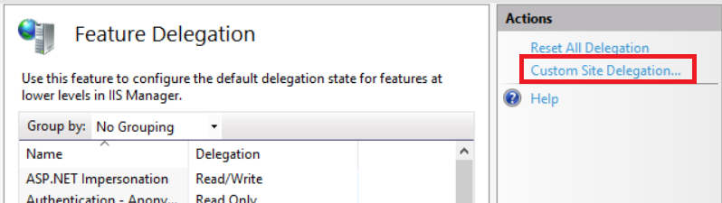

# PowerShellCGI

Why would anyone ever want to create a webpage served by PowerShell code?

I got 99 reasons but speed ain’t one!

(and you probably get more than 99 problems trying to do something serious with this)

## Setup

It’s tested on Windows Server 2019/Internet Information Services (IIS) version 10.

Running `.bat` or `.cmd` files as CGI script just work, but for some reason it’s not the case with `.ps1` files.

[Other persons have similar issues.](https://stackoverflow.com/questions/23727232/using-powershell-as-a-cgi-binary-in-iis-express)

[This small C# program](CGIwrap/CGIwrap.cs) can fix the issue.

Compile it by running `CGIwrap.compile.cmd`, make directory `C:\inetpub\bin` and copy `CGIwrap.exe` into this directory.

### IIS

Here’s some screenshots from IIS to show how it’s set up.

